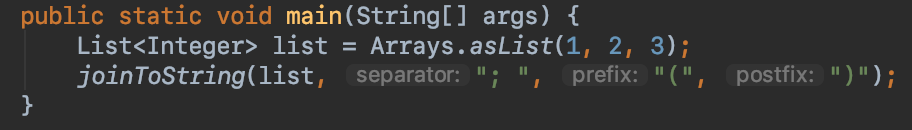

<!-- $size: B4 -->
<!-- page_number: true -->

# 3. 함수 정의와 호출

---

* 컬렉션, 문자열, 정규식을 다루기 위한 함수
* 이름 붙인 인자, 디폴트 파라미터 값, 중위 호출 문법 사용
* 확장 함수와 확장 프로퍼티를 사용해 자바 라이브러리 적용
* 최상위 및 로컬 함수와 프로퍼티를 사용해 코드 구조화

---

# 컬렉션 만들기

---

# 컬렉션 만들기

```kotlin
val set = hashSetOf(1, 7, 53)
// java.util.HashSet

val list = arrayListOf(1, 7, 53)
// java.util.ArrayList

val map = hashMapOf(1 to "one", 7 to "seven", 53 to "fifty-three")
// java.util.HashMap
```

**Kotlin의 컬렉션은 Java의 컬렉션을 그대로 사용한다**

---

# 컬렉션 만들기

```kotlin
val strings = listOf("first", "second", "fourteenth")

println(strings.last())

// fourteenth
```

```kotlin
val numbers = setOf(1, 14, 2)

println(numbers.max())

// 14
```

**Kotlin은 기존의 컬렉션에는 없는 메소드들을 추가로 지원한다.**

---

# joinToString()

```kotlin
val list = listOf(1, 2, 3)

println(list)	// toString() 호출

// [1, 2, 3]
```
다른 형식으로 출력하고 싶다면? 
새로운 함수를 정의하자. 

---

# joinToString()

### Kotlin 함수 정의

```kotlin
fun <T> joinToString(
        collection: Collection<T>,
        separator: String,
        prefix: String,
        postfix: String
): String {
    
    val result = StringBuilder(prefix)
    
    for ((index, element) in collection.withIndex()) {
        if (index > 0) result.append(separator)
        result.append(element)
    }
    
    result.append(postfix)
    
    return result.toString()
}
```

--- 
# joinToString()

### Java

```java
<T> String joinToString(
        Collection<T> collection,
        String separator,
        String prefix,
        String postfix) {

    StringBuilder result = new StringBuilder(prefix);
    Iterator<T> iter = collection.iterator();
    int index = -1;
    while (iter.hasNext()) {
        index++;
        if (index > 0) result.append(separator);
        result.append(iter.next());
    }
    result.append(postfix);

    return result.toString();
}
```

---

# joinToString()

### Java
```java
<T> String joinToString(
        Collection<T> collection,
        String separator,
        String prefix,
        String postfix
)
```

### Kotlin
```kotlin
fun <T> joinToString(
        collection: Collection<T>,
        separator: String,
        prefix: String,
        postfix: String
): String 
```

---

# joinToString()

### Java
```java
StringBuilder result = new StringBuilder(prefix);
Iterator<T> iter = collection.iterator();

int index = -1;
while (iter.hasNext()) {
    index++;
    if (index > 0) result.append(separator);
    result.append(iter.next());
}
result.append(postfix);

return result.toString();
```

### Kotlin
```kotlin
val result = StringBuilder(prefix)

for ((index, element) in collection.withIndex()) {
    if (index > 0) result.append(separator)
    result.append(element)
}
result.append(postfix)
    
return result.toString()
```

---

# joinToString()

```kotlin
val list = listOf(1, 2, 3)

println(joinToString(list, "; ", "(", ")"))

// (1; 2; 3)
```




---
# joinToString()

### 되는 것
```kotlin
joinToString(list, separator = "; ", prefix = "(", postfix = ")")

joinToString(list, postfix = ")", prefix = "(", separator = "; ")

joinToString(list, "; " ,prefix ="(", postfix = ")")
```

### 안 되는 것
```kotlin
joinToString(list, "(", separator = ";",  postfix = ")")	
// An argument is already passed for this parameter 

joinToString(list, ";", prefix ="(", ")")
// Mixing named and positioned arguments is not allowed

```

---

# 디폴트 파라미터

```kotlin
fun <T> joinToString(
        collection: Collection<T>,
        separator: String = ",",
        prefix: String = "",
        postfix: String = ""
): String
```
---

# 디폴트 파라미터

```kotlin
joinToString(list, ", ", "", "")
// 1, 2, 3

joinToString(list)
// 1, 2, 3

joinToString(list, "; ")
// 1; 2; 3

joinToString(list, postfix = ";", prefix = "# ")
// # 1, 2, 3;

```

---

# 디폴트 파라미터

#### Java에서 디폴트 파라미터를 지원하려면? 
메소드 오버로딩

```java
<T> String joinToString(
        Collection<T> collection,
        String separator,
        String prefix,
        String postfix) { ... }
        

<T> String joinToString(
        Collection<T> collection,
        String separator,
        String prefix) { 
        return joinToString(collection, separator, prefix, "");
}

<T> String joinToString(
        Collection<T> collection,
        String separator) { 
        return joinToString(collection, separator, "", "");
}

<T> String joinToString(
        Collection<T> collection) { 
        return joinToString(collection, ", ", "", "");
}
```

---

# 디폴트 파라미터

#### Java에서 디폴트 파라미터를 지원하려면? 
메소드 오버로딩

##### 가능
```java
joinToString(list, ", ", "", "")
// 1, 2, 3

joinToString(list)
// 1, 2, 3

joinToString(list, "; ")
// 1; 2; 3
```

##### 불가능
```java
joinToString(list, postfix = ";", prefix = "# ")
// # 1, 2, 3;
```

___

# 최상위 함수, 최상위 프로퍼티
```kotlin
// join.kt

package strings

fun joinToString(...): String {
	...
}
```

```kotlin
// main.kt
import strings.joinToString

fun main(args: Array<String>) {
    val list = listOf(1, 2, 3)
    println(joinToString(list))
}
```

---
# 최상위 함수, 최상위 프로퍼티

```java
// join.kt의 Java 버전

package strings;

public class JoinKt {
    public static String joinToString(...) {
        ...
    }
}
```

```java
import strings.JoinKt;

...
JoinKt.joinToString(list, ", ", "", "");
```

```java
import static strings.JoinKt.joinToString;

...
joinToString(list, ", ", "", "");
```

--- 
# 최상위 함수, 최상위 프로퍼티

```kotlin
// operation.kt

var opCount = 0

fun performOperation() {
    opCount++
}

fun reportOperationCount() {
    println("Operation performed $opCount times")
}
```

```kotlin
// main.kt

fun main(args: Array<String>) {
    opCount = 30
    println(opCount)
}
```
**같은 패키지 내에서는 어디서나 호출가능**
**다른 패키지라면 import하거나 full name을 이용하여 호출가능**

--- 
# 최상위 함수, 최상위 프로퍼티

```java
// operation.kt의 Java 버전

public class OperationKt {

    private static int opCount;
    
    public static int getOpCount() { 
        return opCount; 
    }
    
    public static void setOpCount(int opCount) { 
        this.opCount = opCount
    }
    ...
}
```
```java
// main.kt의 Java 버전
public class MainKt {

    public static void main(String[] args) {
    
        OperationKt.setOpCount(30);
        System.out.println(OperationKt.getOpCount());
    }
}
```
**기본적으로 getter와 setter가 생성됨**

--- 
# 최상위 함수, 최상위 프로퍼티

##### Kotlin
```kotlin
// constants.kt

val UNIX_LINE_SEPARATOR = "\n"
```

##### Java
```java
// constants.kt의 Java 버전

public class ConstantsKt {

    private static final String UNIX_LINE_SEPARATOR = "\n";
    
    public static String getUNIX_LINE_SEPARATOR() {
        return getUNIX_LINE_SEPARATOR;
    }
}
	
```
**상수(`val`)로 정의한 최상위 프로퍼티는 private 변수와 getter로 변환된다.**


--- 

# 최상위 함수, 최상위 프로퍼티

##### Kotlin
```kotlin
// const를 사용한 constants.kt

const val UNIX_LINE_SEPARATOR = "\n"
```

##### Java
```java
// const를 사용한 constants.kt의 Java 버전

public class ConstantsKt {

   public static final String UNIX_LINE_SEPARATOR = "\n";
}
	
```
**val 상수 앞에 const를 붙이면 private 변수와 getter 대신에 public static final 변수를 만든다.**
**`var` 변수 앞에는 `const`를 붙일 수 없다.**
**`const`는 Top Level이나 object의 프로퍼티에만 붙일 수 있다. (class 안에는 올 수 없다.)

---

# 확장 함수, 확장 프로퍼티
* 어떤 클래스의 멤버 메소드, 멤버변수인 것처럼 호출할 수 있는 함수, 프로퍼티
* 실제로는 그 클래스 밖에 선언됨
* 내가 작성하지 않은 클래스에 대해 메소드와 프로퍼티를 추가할 수 있음

---

# 확장 함수
##### 확장 함수 정의
```kotlin
// stringUtil.kt

package strings

fun String.lastChar(): Char = this.get(this.length - 1)
```
* `String`은 수신 객체 타입 (Receiver type)
* `this`는 수신 객체 (Receiver object)

##### 확장 함수 사용
```kotlin
import strings.lastChar

println("Kotlin".lastChar())
```

---
# 확장 함수
```kotlin
package strings

fun String.lastChar(): Char = this.get(this.length - 1)
```
* 일반적인 클래스의 메소드를 정의할 때와 같이 본문에서 `this`를 사용할 수 있다.

```kotlin
package strings

fun String.lastChar(): Char = get(length - 1)
```
* `this`를 생략할 수도 있다.

### But
* 확장 함수 내에서는 클래스의 private 멤버나 protected 멤버를 사용할 수 없다. 
  (밖에서 접근불가한 멤버는 사용불가)

---

# 확장 함수

```java
pakcage strings; 

public class StringUtilKt {
   public static char lastChar(String receiver) {
      return receiver.charAt(receiver.length() - 1);
   }
}
```
* 확장 함수는 수신 객체를 첫번째 인자로 하는 static 유틸 함수로 변환됨

---

# 확장 함수

```kotlin
import strings.lastChar

println("Kotlin".lastChar())
```
* 확장 함수도 import를 해야 사용할 수 있다.

```kotlin
import strings.*

println("Kotlin".lastChar())
```
* `*`를 사용해 해당 패키지의 모든 멤버를 import할 수 있다.

<!-- 모든 멤버는 함수, 클래스, 프로퍼티 등을 포함한다. -->
```kotlin
import strings.lastChar as last

println("Kotlin".last())
```
* 특정 함수를 다른 이름으로 import 하려면 `as`를 사용한다.
* 확장 함수는 Fully Qualified Name을 사용할 수 없기에 `as`가 꼭 필요할 때가 있다.
<!-- `as`는 `*`와 함께 사용불가 -->
<!-- 여러 패키지에서 같은 이름의 함수를 하나의 파일에서 사용하려고 할 때 `as` 필요 -->


---

# 확장 함수

##### joinToString()의 최상위 함수 버전

```kotlin
fun <T> joinToString(
        collection: Collection<T>,
        separator: String,
        prefix: String,
        postfix: String
): String {
    
    val result = StringBuilder(prefix)
    
    for ((index, element) in collection.withIndex()) {
        if (index > 0) result.append(separator)
        result.append(element)
    }
    
    result.append(postfix)
    
    return result.toString()
}

```

---

# 확장 함수

##### joinToString()의 확장 함수 버전

```kotlin
// 함수명 앞에 확장할 클래스인 `Collection<T>`를 붙임
fun <T> Collection<T>.joinToString(  // 인자로 전달하던 `Collection<T>` 파라미터 제거
        separator: String = ", ",  
        prefix: String = "",
        postfix: String = ""
): String {

    val result = StringBuilder(prefix)

    // 인자로 받은 `collection` 대신 수신 객체 `this` 사용
    for ((index, element) in this.withIndex()) {
        if (index > 0) result.append(separator)
        result.append(element)
    }

    result.append(postfix)

    return result.toString()
}
```

---

# 확장 함수

##### joinToString()의 최상위 함수 버전
```kotlin
joinToString(list, separator = "; ", prefix = "(", postfix = ")")
```

##### joinToString()의 확장 함수 버전
```kotlin
list.joinToString(separator = "; ", prefix = "(", postfix = ")")
```

---

# 확장 함수

##### 확장 함수 범위 제한하기
```kotlin
fun Collection<String>.join(
        separator: String = ", ",
        prefix: String = "",
        postfix: String = ""
) = joinToString(separator, prefix, postfix)
```
* 원소의 타입이 String인 컬렉션에만 `join` 메소드가 추가된다.

```kotlin
println(listOf("one", "two", "three").join(" "))
// one two three

println(listOf(1, 2, 3).join(" "))
// Error!!
```

---

# 확장 함수 (오버라이드)
##### 멤버 메소드끼리 오버라이드
```kotlin
open class View {
    open fun click() = println("View clicked")
}

class Button: View() {
    override fun click() = println("Button clicked")
}
```

```kotlin
val view: View = Button()
view.click()
// Button clicked
```
* 자식 클래스에서 같은 이름의 메소드는 오버라이드되어 실행시 동적으로 디스패치된다.

---

# 확장 함수 (오버라이드)
##### 멤버 메소드를 확장 메소드로 오버라이드(?)
```kotlin
open class View {
    open fun click() = println("View clicked")
}

class Button: View()

fun Button.click() = println("Button clicked")
```

```kotlin
val view: View = Button()
view.click()
// View clicked
```
* 자식 클래스를 확장한 메소드는 부모 클래스에 같은 이름의 메소드가 있었어도 오버라이드하지 않는다. 
```java
// Button.click() 확장 함수를 Java로 변환한 내용
public class ViewKt {
    public static void click(Button view) {
        System.out.println("Button clicked")
    }
}
```
* 위의 메소드에 View 타입의 인자를 전달할 수 없다.

---

# 확장 함수 (오버라이드)
##### 확장 메소드를 멤버 메소드로 오버라이드(?)
```kotlin
open class View {}
fun View.click() = println("View clicked")

class Button: View() {
    fun click() = println("Button clicked")
}
```

```kotlin
val view: View = Button()
view.click()
// View clicked
```
* View 타입으로 접근할 수 있는 메소드는 View의 확장 함수 뿐이다.

---

# 확장 함수 (오버라이드)
##### 확장 메소드끼리 오버라이드(?)
```kotlin
open class View {}
fun View.click() = println("View clicked")

class Button: View() {}
fun Button.click() = println("Button clicked")

```

```kotlin
val view: View = Button()
view.click()
// View clicked
```
* View 타입으로 접근할 수 있는 메소드는 View의 확장 함수 뿐이다.

---

# 확장 함수 (오버라이드)
##### 확장 메소드끼리 오버라이드(?)
```kotlin
open class View {}
fun View.click() = println("View clicked")

class Button: View() {}
fun Button.click() = println("Button clicked")

```
* 위의 두 메소드는 오버로딩에 가깝다.
```java
// java
public class ViewKt {
    public static void click(View view) {
        System.out.println("View clicked")
    }
    
    public static void click(Button button) {
        System.out.println("Button clicked")    
    }
}
```

---

# 확장 함수 (오버라이드)
##### 확장 메소드끼리 오버라이드(?)
```kotlin
open class View {}
fun View.click() = println("View clicked")

class Button: View() {}
fun Button.click() = println("Button clicked")

```

```kotlin
val button = Button()
button.click()
// Button clicked
```
* 좀더 구체적인 타입인 Button의 확장 함수를 호출한다.

---

# 확장 함수 (오버라이드)
##### 확장 메소드끼리 오버라이드(?)
```kotlin
open class View {}
fun View.click() = println("View clicked")

class Button: View() {}
// fun Button.click() = println("Button clicked")

```

```kotlin
val button = Button()
button.click()
// View clicked
```
* Button 객체를 View 타입 인자에 전달할 수 있으므로 View의 확장 함수를 호출한다.

---

# 확장 함수 (오버라이드)
##### 확장 메소드와 멤버 메소드의 선택
```kotlin
open class View {
    open fun click() = println("View clicked")
}

class Button: View()

fun Button.click() = println("Button clicked")
```

```kotlin
val button = Button()
button.click()
// View clicked
```
* Button 객체를 통해 호출하였고, 두 메소드가 다 접근가능하지만, View의 메소드를 호출하였다.
* 이유는 확장 메소드보다 멤버 메소드에 우선순위가 있기 때문이다.

---

# 확장 함수 (오버라이드)
##### 확장 메소드와 멤버 메소드의 선택
```kotlin
open class View {
//    open fun click() = println("View clicked")
}

class Button: View()

fun Button.click() = println("Button clicked")
```

```kotlin
val button = Button()
button.click()
// Button clicked
```
* 위와 같이 View의 멤버 메소드가 없으면 확장 메소드가 호출된다.

---

# 확장 함수
## 확장 함수와 일반 메소드의 다른 점
* 확장 함수는 숨겨진 멤버(private, protected)에 접근할 수 없다.
* 확장 함수는 부모 클래스의 메소드를 오버라이드 할 수 없다.

---

# 확장 프로퍼티

```kotlin
val String.lastChar: Char
    get() = get(length - 1)
```

```kotlin
println("Kotlin".lastChar)
// n
```
* 확장 프로퍼티는 클래스의 멤버 프로퍼티처럼 사용할 수 있으나 클래스의 외부에 선언한다.
* 확장 프로퍼티는 기존 클래스의 멤버 필드를 추가할 수는 없다. 즉, 상태를 가질 수 없다.
* getter와 setter 또는 getter 하나로 정의된다.
* `val` 프로퍼티는 getter만 있어야 하고, `var` 프로퍼티는 getter와 setter가 둘 다 있어야 한다.

---

# 확장 프로퍼티

```kotlin
var StringBuilder.lastChar: Char
    get() = get(length - 1)
    set(value: Char) {
        this.setCharAt(length - 1, value)
    }
```
```kotlin
val sb = StringBuilder("Kotlin?")
sb.lastChar = '!'

println(sb)
// Kotlin!
```

--- 

# 가변 길이 인자
```kotlin
val list = listOf(2, 3, 5, 7, 11)
```
* 인자의 개수가 정해져 있지 않다.

#### Java
```java
<T> List<T> listOf(T... values) { ... }
```

#### Kotlin
```kotlin
fun <T> listOf(vararg values: T): List<T> { ... }
```

---

# 가변 길이 인자

#### Java
```java
    String[] strs = { "one", "two", "three" };
    List<String> list = listOf(strs);
    // [one, two, three]
```
* Java의 경우 배열을 전달하면 배열의 원소를 나열해서 전달한 것과 같이 동작한다.
* List를 전달하면 List 타입의 객체 하나를 전달한 것과 같이 취급한다.

#### Kotlin
```kotlin
    val strs = arrayOf("one", "two", "three")
    val list = listOf("args", *strs, "end")
    // [args, one, two, three, end]
    
    val list2 = listOf(strs)	// List<Array<String>>
    // [[one, two, three]]
```
* Kotlin의 경우 배열을 풀어서 전달하려면 Spread 연산자(`*`)를 사용해야 한다.
* 배열을 그냥 넘기면 배열 객체 하나를 전달한 것과 같이 취급한다.
<!-- List를 Spread 할 수 없다. -->
* Spread 연산자 앞 뒤로 다른 인자를 전달할 수도 있다.

---

# 중위 호출

```kotlin
val map = mapOf(1 to "one", 7 to "seven", 53 to "fifty-three")
```

```kotlin
1.to("one")
1 to "one"
```
* 위의 둘은 같은 의미
* `1`이라는 객체에 있는 `to`라는 메소드를 `"one"`을 인자로 전달하여 호출하는 것

```kotlin
infix fun Any.to(other: Any) = Pair(this, other)
```
* 함수 정의 앞에 `infix`를 붙이면 중위 호출을 허용함
* `infix`가 붙을 수 있는 함수는 파라미터가 딱 하나 있는 멤버 함수 (또는 확장 함수)

--- 

# Pair, 구조 분해 선언 (destructuring declaration)

```kotlin
val pair = Pair(1, "one")
println(pair)
// (1, one)
```
* Pair는 두 원소로 이루어진 순서쌍

```kotlin
val (number, name) = pair
```
* Pair는 구조 분해 선언으로 한번에 두 개의 변수에 나눠 할당할 수 있다.

--- 

# 구조 분해 선언 (destructuring declaration)

```kotlin
val list = listOf(10, 30, 50)

for ((index, element) in collection.withIndex()) {
    println("$index: $element")
}

// 0: 10
// 1: 30
// 2: 50
```
```kotlin
val collection = mapOf(13 to "Blue", 24 to "Red", 32 to "Green")

for ((key, value) in collection) {
    println("$key: $value")
}

// 13: Blue
// 24: Red
// 32: Green
```
* 구조 분해 선언은 컬렉션에도 적용가능함
* 어떤 값이 어디에 들어갈지는 관례(convention)에 따라 정해짐

---

# 문자열과 정규식

##### Java
```java
"12.345-6.A".split(".")
// { } 비어있는 배열
```
* "."을 정규식으로 해석

##### Kotlin
```kotlin
"12.345-6.A".split(".")
// [12, 345-6, A] `.`로 나눈 문자열 리스트
```
* "."을 문자열로 해석

```kotlin
"12.345-6.A".split("\\.".toRegex())
// [12, 345-6, A] `.`로 나눈 문자열 리스트
```
* 문자열을 정규식으로 사용하려면 `toRegex()`를 호출함

* Java의 String과 Kotlin의 String은 서로 상호 전달 가능한 같은 객체이지만, Kotlin의 String은 편의를 위해 몇 가지 API를 바꿔서 제공한다.

---

# 문자열과 정규식

```kotlin
fun parsePath(path: String) {
    val regex = """(.+)/(.+)\.(.+)""".toRegex()
    val matchResult = regex.matchEntire(path)
    if (matchResult != null) {
        val (directory, filename, extension) = matchResult.destructured
        println("Dir: $directory, name: $filename, ext: $extension")
    }
}
```
* 3중 따옴표 문자열은 이스케이프가 없다.
* 줄바꿈을 포함한 모든 문자를 문자 그대로 해석한다. (template 예외 (`${...}`)

---

# 3중 따옴표 문자열

```kotlin
val jsonString = """
    .{
    .    "name": "John",
    .    "age": 30,
    .    "married": true
    .}
    """
println(jsonString.trimMargin("."))  
/*
{
    "name": "John",
    "age": 30,
    "married": true
}
*/
```
* 3중 따옴표 문자열은 이스케이프가 없이 쓸 수 있으므로 줄바꿈을 포함한 문자열을 작성하는데 편하다.
* 들여쓰기도 문자열의 내용으로 들어간다.
* 들여쓰기를 제거하기 위해 특정 문자를 들여쓰기 위치에 넣고 `trimMargin(...)` 메소드를 사용할 수 있다.

---

# 3중 따옴표 문자열

```kotlin
val price = """${'$'}99.9"""

println(price)
// $99.9
```
* 3중 따옴표 문자열 안에서 템플릿은 사용가능하므로 템플릿과 혼동될 수 있는 `$` 문자는 위와 같이 표현한다.

---

# 로컬 함수

```kotlin
class User(val id: Int, val name: String, val address: String)

fun saveUser(user: User) {
    if (user.name.isEmpty()) {
        throw IllegalArgumentException(
                "Can't save user ${user.id}: empty Name")
    }

    if (user.address.isEmpty()) {
        throw IllegalArgumentException(
                "Can't save user ${user.id}: empty Address")
    }
    // user를 데이터베이스에 저장한다.
}

fun main(args: Array<String>) {
    saveUser(User(1, "", ""))
}
```
* User의 필드가 비었는지 검사하는 코드가 중복됨
---

# 로컬 함수

```kotlin
class User(val id: Int, val name: String, val address: String)

fun saveUser(user: User) {
    validate(user, user.name, "Name")
    validate(user, user.address, "Address")
    // user를 데이터베이스에 저장한다.
}

fun validate(user: User, value: String, fieldName: String) {
    if (value.isEmpty()) {
        throw IllegalArgumentException(
                "Can't save user ${user.id}: empty $fieldName")
    }
}

fun main(args: Array<String>) {
    saveUser(User(1, "", ""))
}
```
* 중복된 로직을 별도의 메소드로 분리해서 사용

---

# 로컬 함수

```kotlin
class User(val id: Int, val name: String, val address: String)

fun saveUser(user: User) {
    fun validate(user: User, value: String, fieldName: String) {
        if (value.isEmpty()) {
            throw IllegalArgumentException(
                    "Can't save user ${user.id}: empty $fieldName")
        }
    }
    validate(user, user.name, "Name")
    validate(user, user.address, "Address")
    // user를 데이터베이스에 저장한다.
}


fun main(args: Array<String>) {
    saveUser(User(1, "", ""))
}
```
* `validate`는 `saveUser` 안에서만 사용할 메소드이므로 `saveUser` 안에 넣어도 된다. 
* 이렇게 함수가 중첩된 경우 안에 있는 함수를 로컬 함수라고 한다.

---

# 로컬 함수

```kotlin
class User(val id: Int, val name: String, val address: String)

fun saveUser(user: User) {
    fun validate(value: String, fieldName: String) {
        if (value.isEmpty()) {
            throw IllegalArgumentException(
                    "Can't save user ${user.id}: empty $fieldName")
        }
    }
    validate(user.name, "Name")
    validate(user.address, "Address")
    // user를 데이터베이스에 저장한다.
}


fun main(args: Array<String>) {
    saveUser(User(1, "", ""))
}
```
* 로컬 함수에서는 자신이 속해 있는 부모 함수의 파라미터, 지역변수에 접근이 가능하다.
* 따라서 기존 코드에서처럼 `user`를 전달받지 않아도 된다.

---

# 로컬 함수


```kotlin
class User(val id: Int, val name: String, val address: String)

fun User.validateBeforeSave() {
    fun validate(value: String, fieldName: String) {
        if (value.isEmpty()) {
            throw IllegalArgumentException(
                    "Can't save user ${this.id}: empty $fieldName")
        }
    }
    validate(name, "Name")
    validate(address, "Address")
}

fun saveUser(user: User) {
    user.validateBeforeSave()
    // user를 데이터 베이스에 저장한다.
}

fun main(args: Array<String>) {
    saveUser(User(1, "", ""))
}
```
* 확장 메소드 내에도 로컬 함수를 넣을 수 있다.
* 로컬 함수에서는 부모 메소드에서 접근가능한 파라미터, 지역변수, 수신객체(`this`) 등에 모두 접근할 수 있다.

---

# 로컬 함수

```kotlin
class User(val id: Int, val name: String, val address: String)

fun saveUser(user: User) {
    fun User.validateBeforeSave() {
        fun validate(value: String, fieldName: String) {
            if (value.isEmpty()) {
                throw IllegalArgumentException(
                        "Can't save user ${this.id}: empty $fieldName")
            }
        }
        validate(name, "Name")
        validate(address, "Address")
    }
    user.validateBeforeSave()
    // user를 데이터 베이스에 저장한다.
}

fun main(args: Array<String>) {
    saveUser(User(1, "", ""))
}
```
* 확장 함수를 다른 함수 안에 로컬 함수로 넣을 수도 있다.

---

# 로컬 함수

##### Java

```java
public static void saveUser(User2 user) {
    BiConsumer<String, String> validate = new BiConsumer<>() {
        @Override
        public void accept(String value, String fieldName) {
            if (value.isEmpty()) {
              throw new IllegalArgumentException("Can't save user " + user.getId() + ": empty " + fieldName);
            }
        }
    };
    validate.accept(user.getName(), "Name");
    validate.accept(user.getAddress(), "Address");
}
```
* Java에서는 메소드 내에 로컬 함수를 가질 수는 없지만, 메소드 내에 inner class를 가질 수는 있다.
* Java로 변환하면 위와 비슷한 코드로 변환할 수 있다.